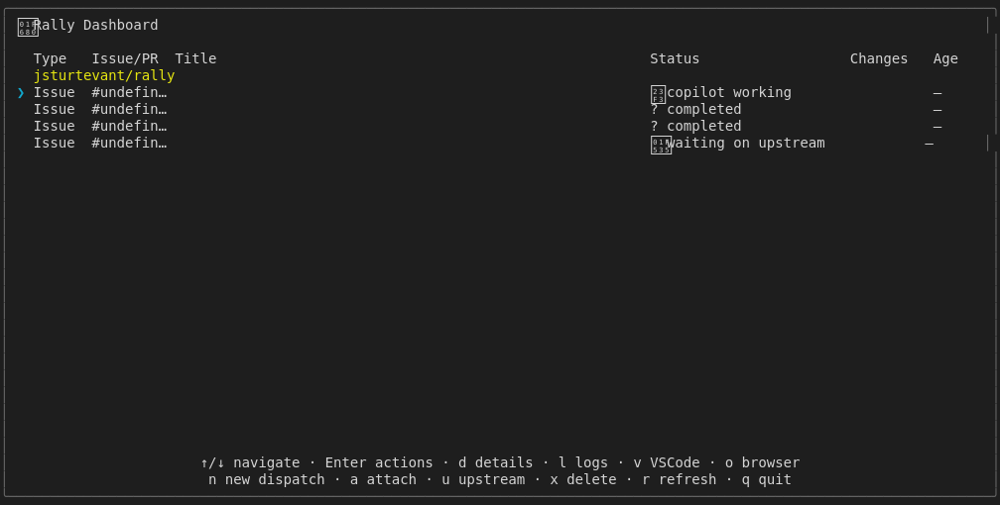
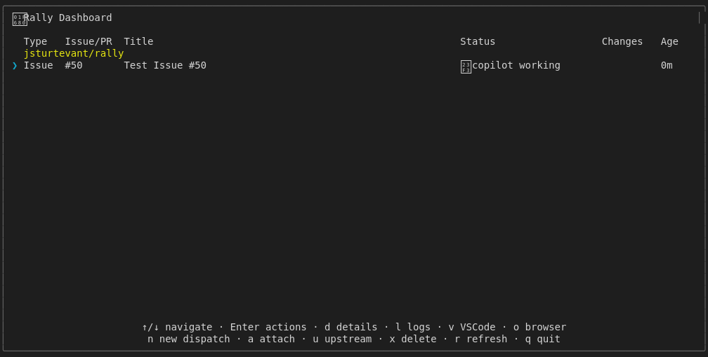

# Clean Completed Items Action Shortcut (Mock-based)

Tests the 'c' key to clean all completed items.
Should show count of items cleaned.
Uses isolated RALLY_HOME temp directory to avoid affecting user config.
For real GitHub integration tests, see real-dispatch.test.js

## Screenshots

The following screenshots show the visual state at each step:

### Before Clean

### After Clean

### Clean Count

### No Completed

### After Clean None

### Specific Clean

---

*Generated from [`test/e2e/journeys/actions/clean.test.js`](../../test/e2e/journeys/actions/clean.test.js)*
