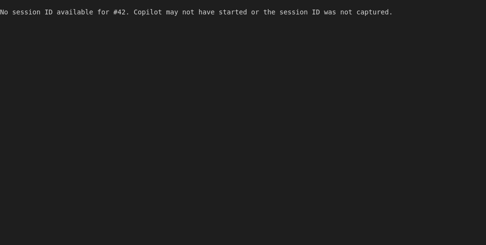
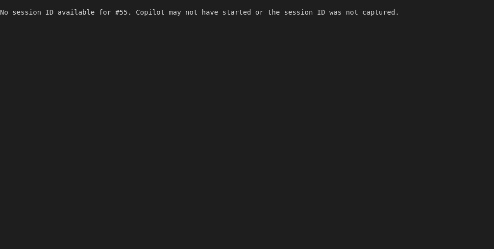

# Continue/Attach Action Shortcut (Mock-based)

Tests the 'a' key to attach to an existing session.
Works when there's an active dispatch.
Uses isolated RALLY_HOME temp directory to avoid affecting user config.
For real GitHub integration tests, see real-dispatch.test.js

## Screenshots

The following screenshots show the visual state at each step:

### Dashboard

### After Attach

### Empty Dashboard

### After Attach Empty

### Attach Paused

---

*Generated from [`test/e2e/journeys/actions/continue.test.js`](../../test/e2e/journeys/actions/continue.test.js)*
