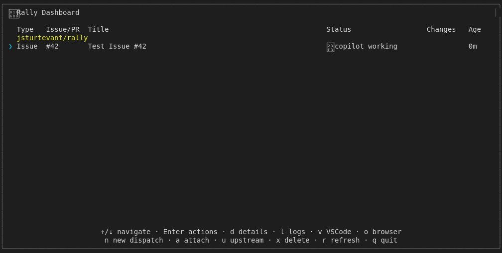

# Open Browser Action Shortcut (Mock-based)

Tests the 'o' key to open browser for viewing the issue/PR.
Since we can't actually open a browser in tests, we verify
the command is dispatched correctly.
Uses isolated RALLY_HOME temp directory to avoid affecting user config.
For real GitHub integration tests, see real-dispatch.test.js

## Screenshots

The following screenshots show the visual state at each step:

### Dashboard With Dispatch

### After Open Browser

---

*Generated from [`test/e2e/journeys/actions/open-browser.test.js`](../../test/e2e/journeys/actions/open-browser.test.js)*
