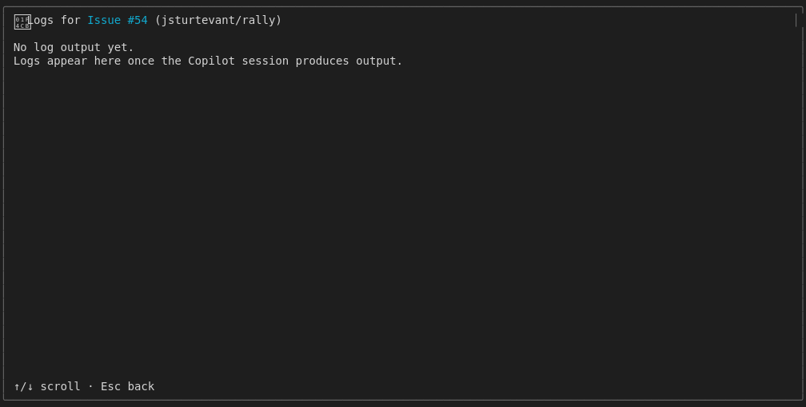
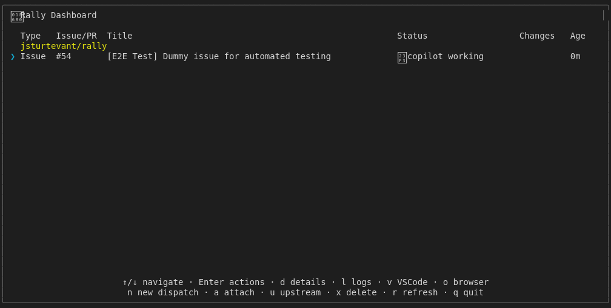
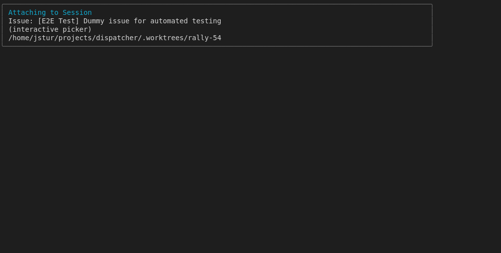
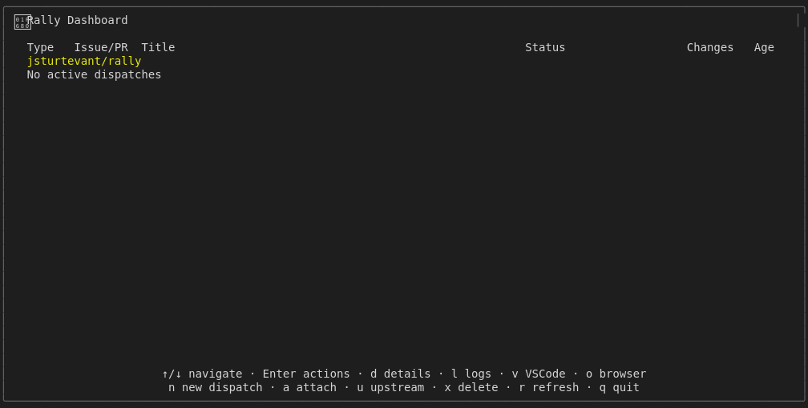

# Action Shortcuts with Real GitHub Integration

Tests all action shortcuts (l, a, u, x, c, o) using a real dispatch
to GitHub issue #54. Uses a shared dispatch for efficiency.
This test file:
- Skips if gh CLI not authenticated
- Uses isolated RALLY_HOME temp directory
- Dispatches once to issue #54, tests multiple shortcuts
- Cleans up dispatch after all tests

## Screenshots

The following screenshots show the visual state at each step:

### Dashboard Before Log

### Log View

### Dashboard Before Attach

### After Attach

### Dashboard Before Upstream

### After Upstream

### Dashboard Before Open

### After Open

### Dashboard Before Remove

### After Remove

### Remove Confirmation

### After Cancel Remove

### Navigation Start

### Before Refresh

### After Refresh

### Before Quit

---

*Generated from [`test/e2e/journeys/actions/real-dispatch.test.js`](../../test/e2e/journeys/actions/real-dispatch.test.js)*
