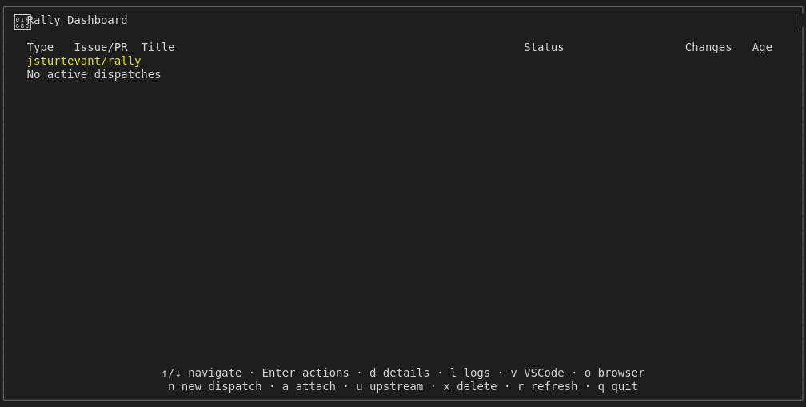
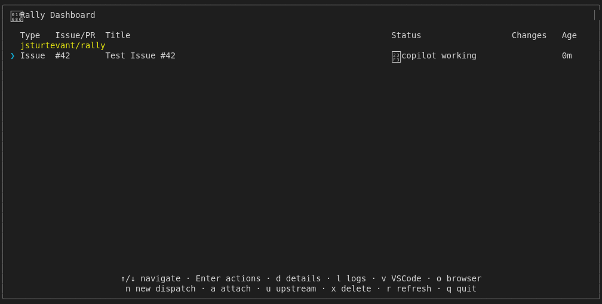

# Remove Worktree Action Shortcut (Mock-based)

Tests the 'x' key to remove a worktree.
Note: The 'x' key removes immediately without a confirmation prompt.
Uses isolated RALLY_HOME temp directory to avoid affecting user config.
For real GitHub integration tests, see real-dispatch.test.js

## Screenshots

The following screenshots show the visual state at each step:

### Before Remove

### After Remove

### Confirmation Prompt

### Before Confirm

### With Dispatch

### After Confirm

### After Remove Refresh

### Before Cancel

### After Cancel

### After Escape

---

*Generated from [`test/e2e/journeys/actions/remove.test.js`](../../test/e2e/journeys/actions/remove.test.js)*
