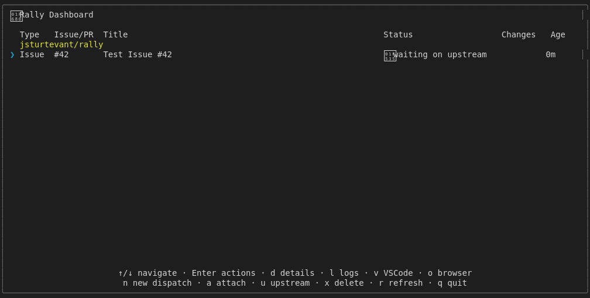

# Upstream Status Action Shortcut (Mock-based)

Tests the 'u' key to mark an item as "waiting on upstream".
Status icon should change to 🟣.
Uses isolated RALLY_HOME temp directory to avoid affecting user config.
For real GitHub integration tests, see real-dispatch.test.js

## Screenshots

The following screenshots show the visual state at each step:

### Before Upstream

### After Upstream

### Status Updated

### Empty Dashboard

### Starting Upstream

### After Toggle

---

*Generated from [`test/e2e/journeys/actions/upstream.test.js`](../../test/e2e/journeys/actions/upstream.test.js)*
