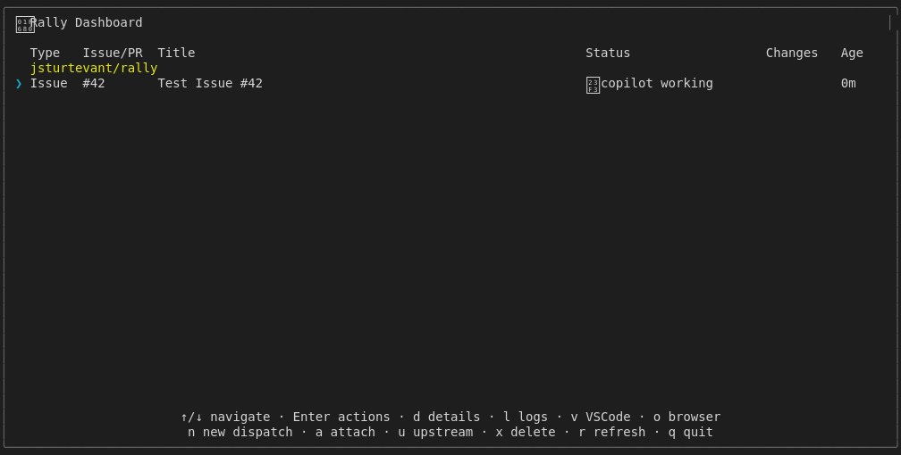

# View Log Action Shortcut (Mock-based)

Tests the 'l' key to view copilot log output
and Escape to return to dashboard.
Uses isolated RALLY_HOME temp directory to avoid affecting user config.
For real GitHub integration tests, see real-dispatch.test.js

## Screenshots

The following screenshots show the visual state at each step:

### Dashboard

### Log View

### Log Before Escape

### After Escape

---

*Generated from [`test/e2e/journeys/actions/view-log.test.js`](../../test/e2e/journeys/actions/view-log.test.js)*
