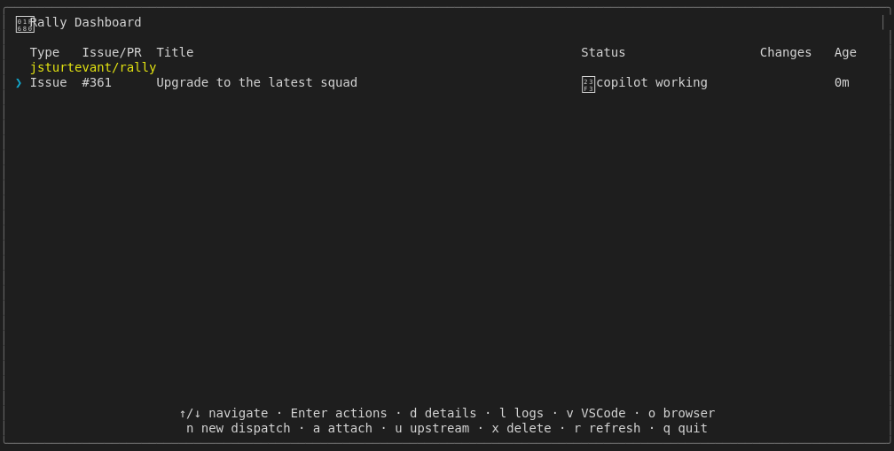

# Dispatch to Issue via Dashboard UI

Tests the complete user journey for dispatching to a GitHub issue
through the interactive dashboard interface.
This is a skeptical test — it checks error paths, timeouts, and
edge cases alongside the happy path.
Uses isolated RALLY_HOME temp directory to avoid affecting user config.

## Screenshots

The following screenshots show the visual state at each step:

### Dashboard

### Project Browser

### Item Picker

### Issue Selected

### Dispatch Complete

### Dashboard With Dispatch

---

*Generated from [`test/e2e/journeys/dispatch/issue.test.js`](../../test/e2e/journeys/dispatch/issue.test.js)*
