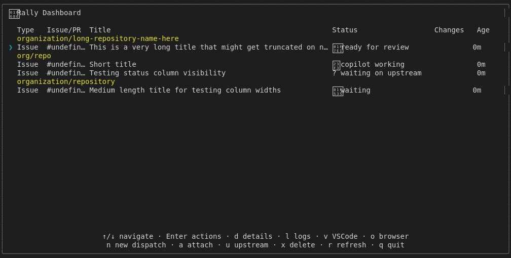
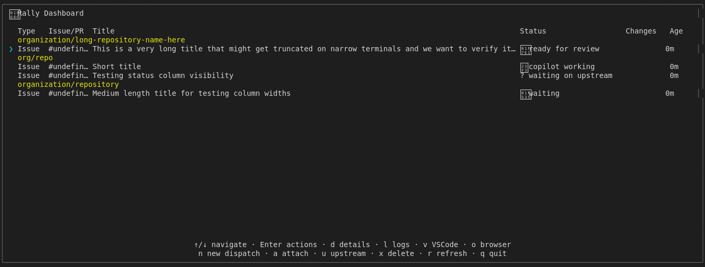
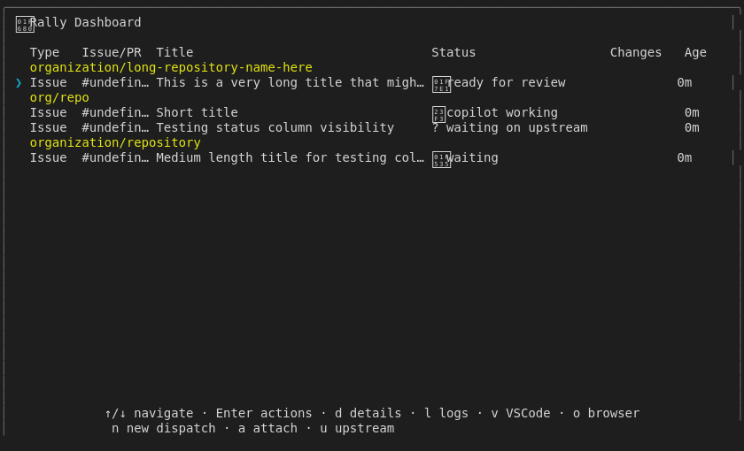
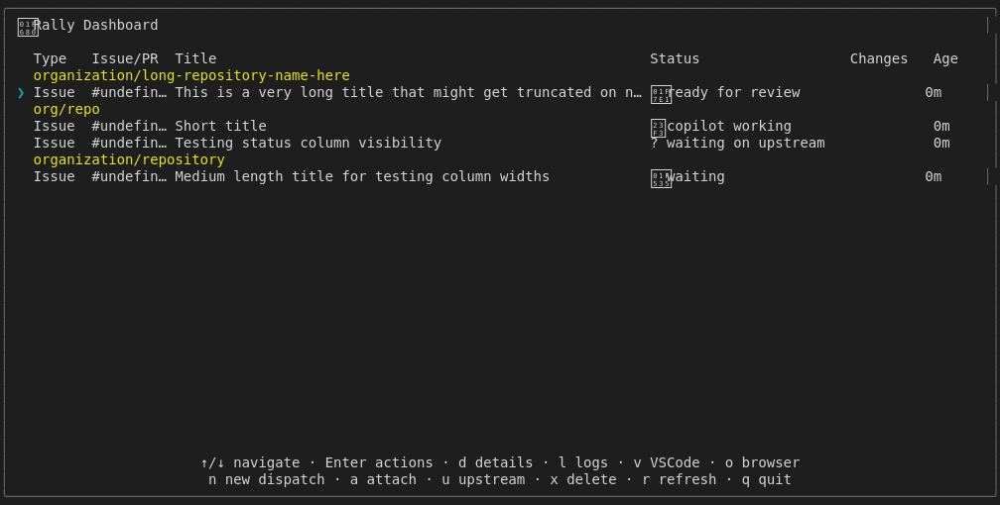
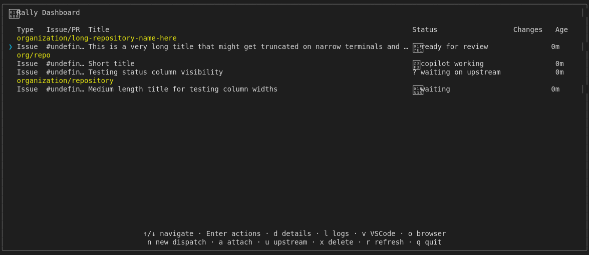
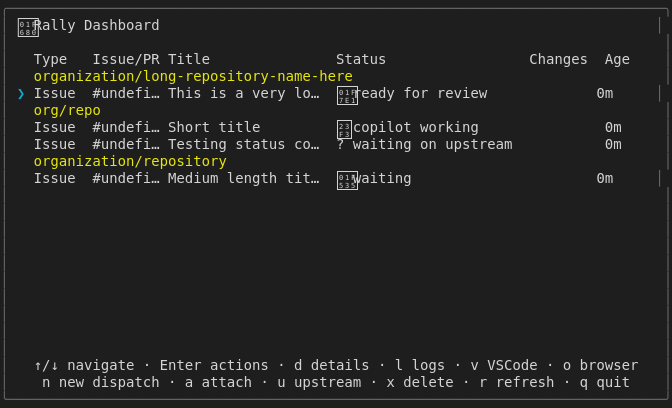
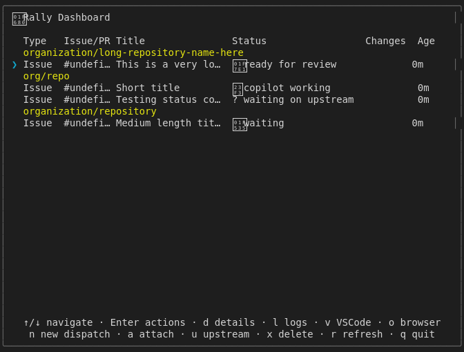

# Display Column Widths

## Screenshots

The following screenshots show the visual state at each step:

### Resize Before

### Resize Narrow

### Resize Wide

### Width 100 Status Check

### Width 120 Status Check

### Width 140 Status Check

### Width 160 Cols

### Width 160 Status Check

### Width 80 Cols

### Width 80 Status Check

---

*Generated from [`test/e2e/journeys/display/column-widths.test.js`](../../test/e2e/journeys/display/column-widths.test.js)*
