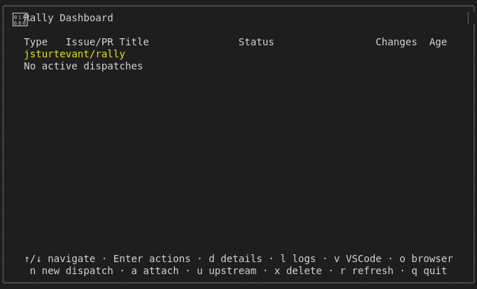
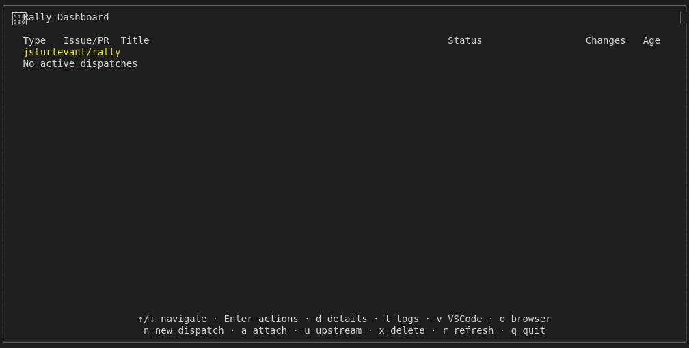

# Display Empty State

## Screenshots

The following screenshots show the visual state at each step:

### Empty 80x24

### Empty Dashboard

### Empty With Hints

---

*Generated from [`test/e2e/journeys/display/empty-state.test.js`](../../test/e2e/journeys/display/empty-state.test.js)*
