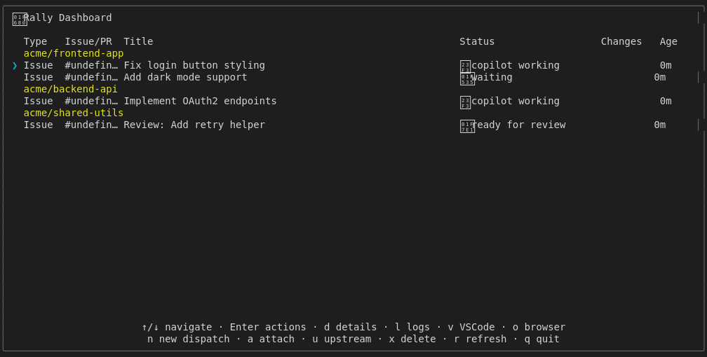
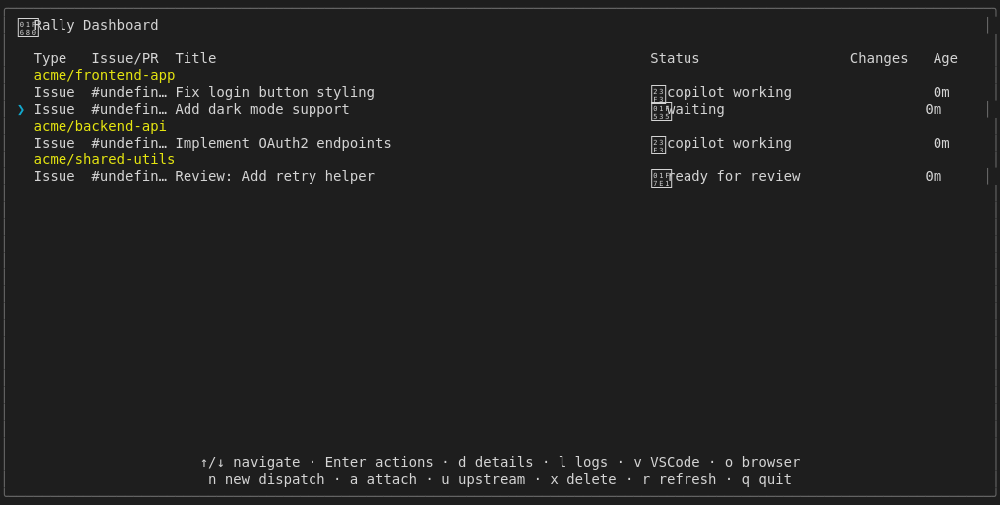

# Display Multi Project

## Screenshots

The following screenshots show the visual state at each step:

### Multi Project Grouped

### Navigation 1

### Navigation 2

### Navigation 3

### Repo Section Headers

---

*Generated from [`test/e2e/journeys/display/multi-project.test.js`](../../test/e2e/journeys/display/multi-project.test.js)*
