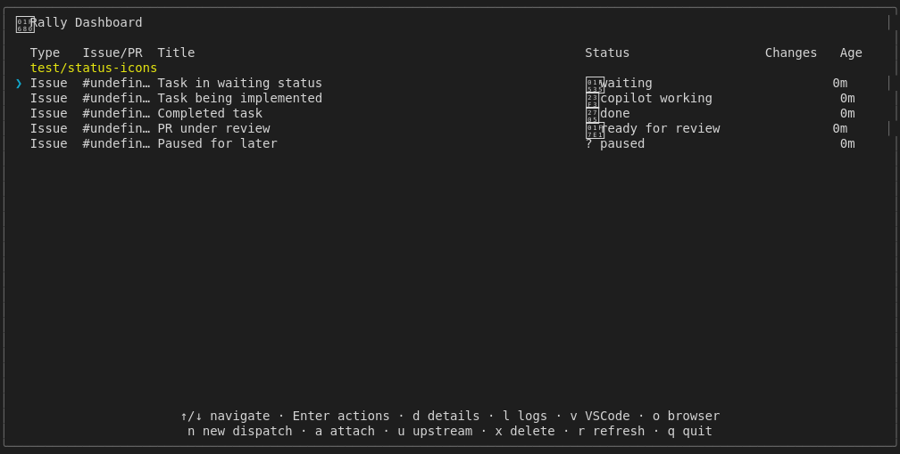
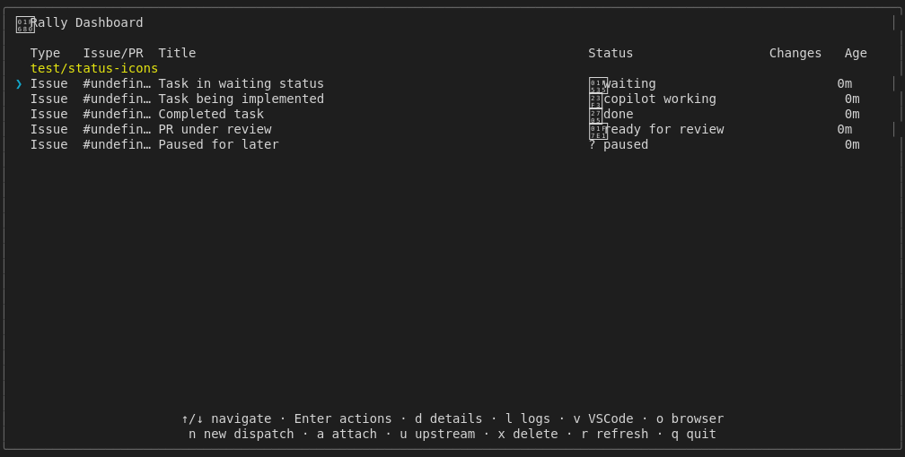

# Display Status Icons

## Screenshots

The following screenshots show the visual state at each step:

### All Status Icons

### Status Consistency

### Status Done

### Status Implementing

### Status Paused

### Status Waiting

---

*Generated from [`test/e2e/journeys/display/status-icons.test.js`](../../test/e2e/journeys/display/status-icons.test.js)*
