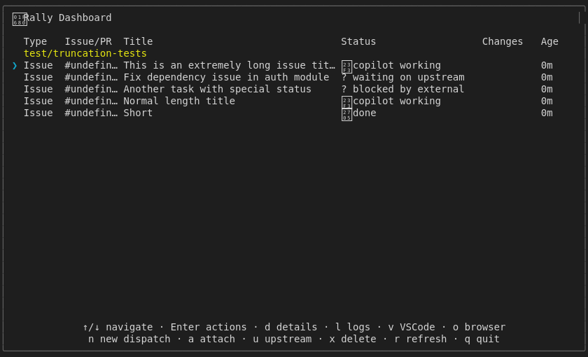
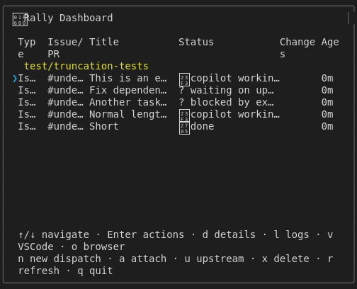
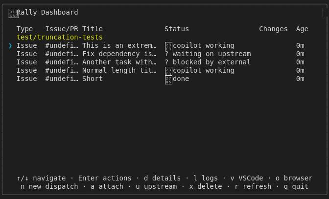
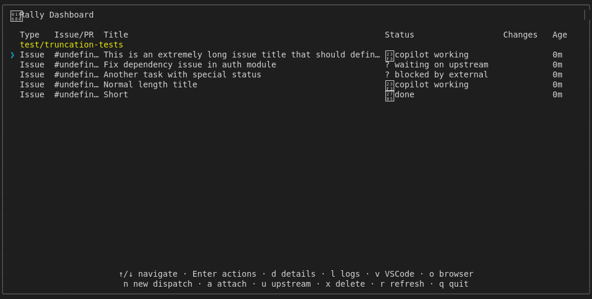

# Display Truncation

## Screenshots

The following screenshots show the visual state at each step:

### Long Titles 80

### Mixed Content

### Narrow Truncation

### Status Visible

### Waiting Upstream 80cols

### Waiting Upstream Visible

---

*Generated from [`test/e2e/journeys/display/truncation.test.js`](../../test/e2e/journeys/display/truncation.test.js)*
