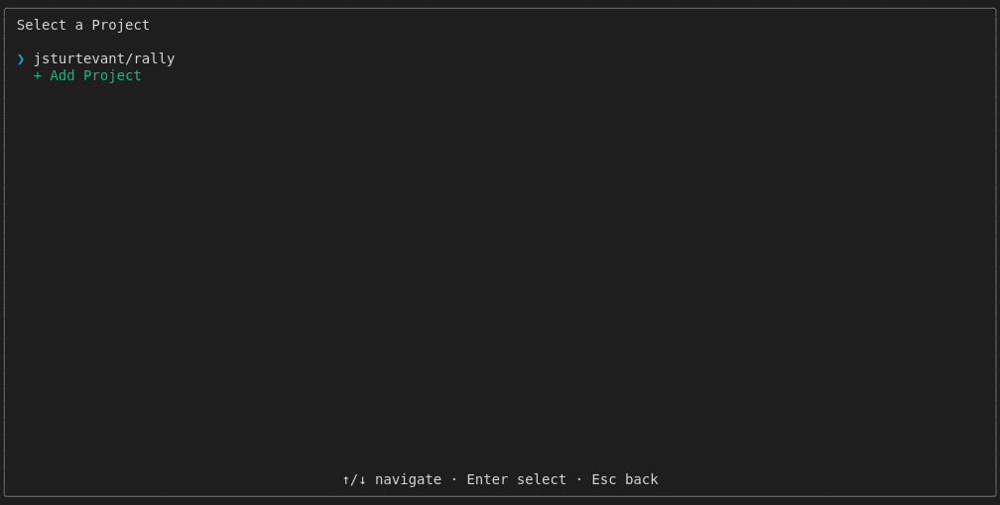

# Lifecycle Cancel

## Screenshots

The following screenshots show the visual state at each step:

### Dashboard

### Project Selection

### Returned To Dashboard

### Item Picker

### Before Quit

---

*Generated from [`test/e2e/journeys/lifecycle/cancel.test.js`](../../test/e2e/journeys/lifecycle/cancel.test.js)*
