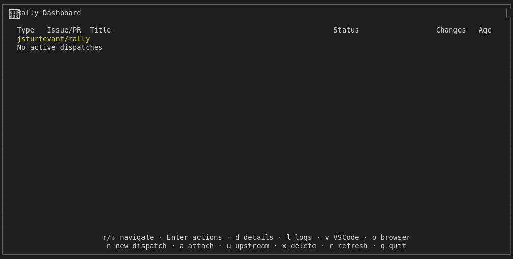
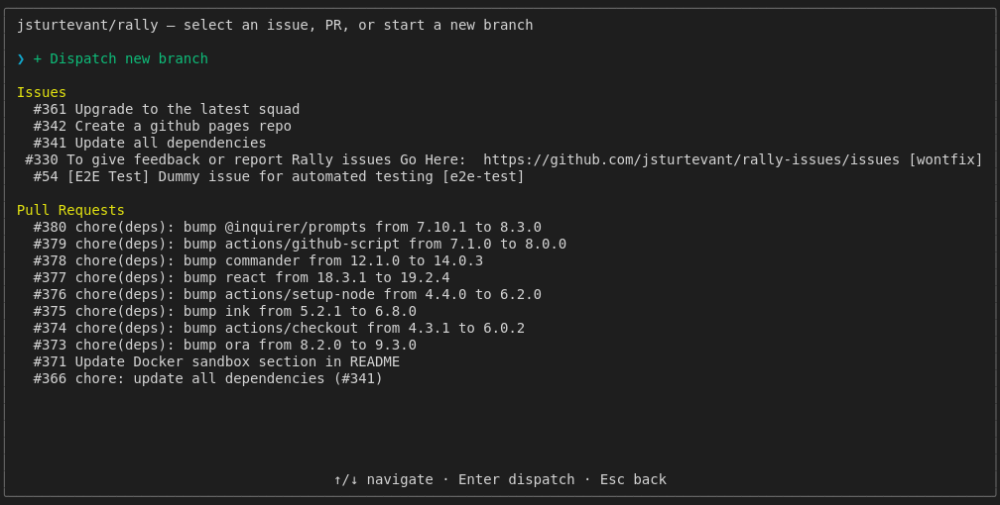
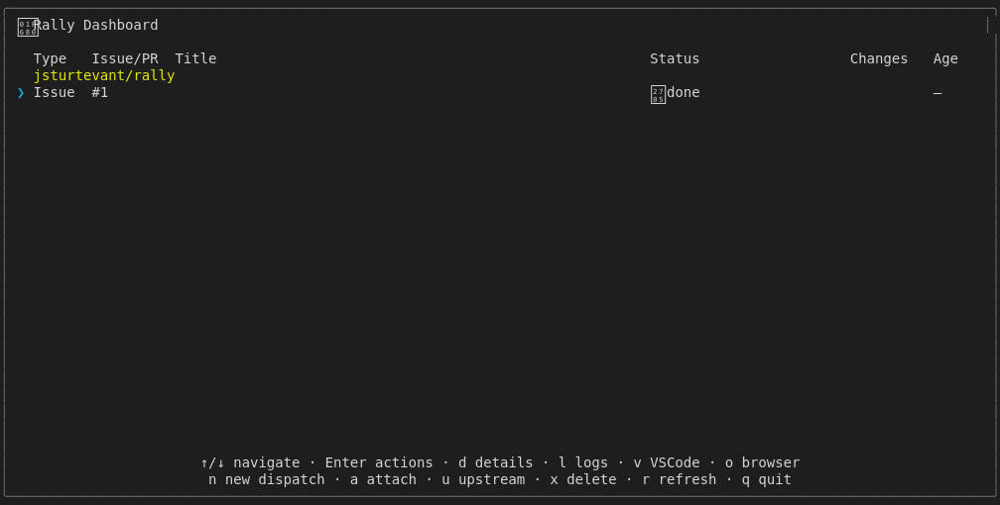
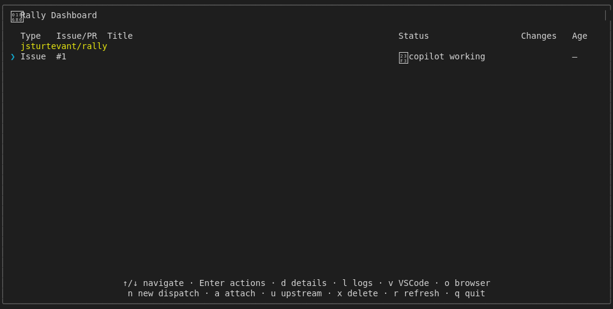
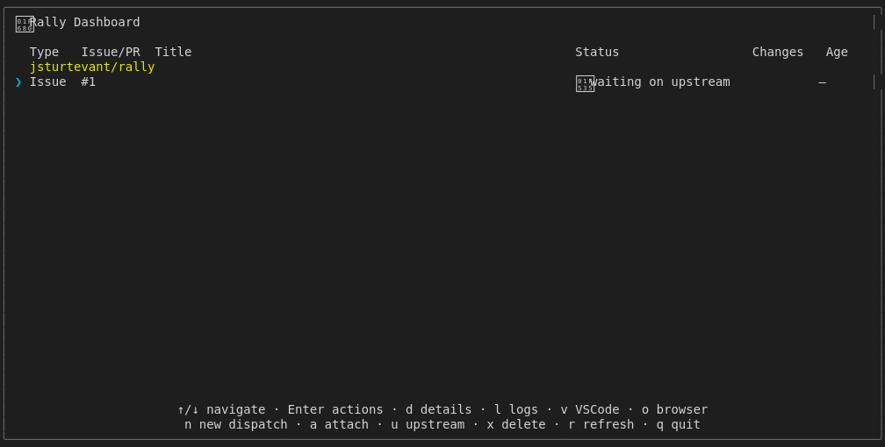

# Lifecycle Complete

## Screenshots

The following screenshots show the visual state at each step:

### Empty Dashboard

### Select Project

### Select Item

### Implementing

### Status Done

### Status Implementing

### Status Upstream

---

*Generated from [`test/e2e/journeys/lifecycle/complete.test.js`](../../test/e2e/journeys/lifecycle/complete.test.js)*
