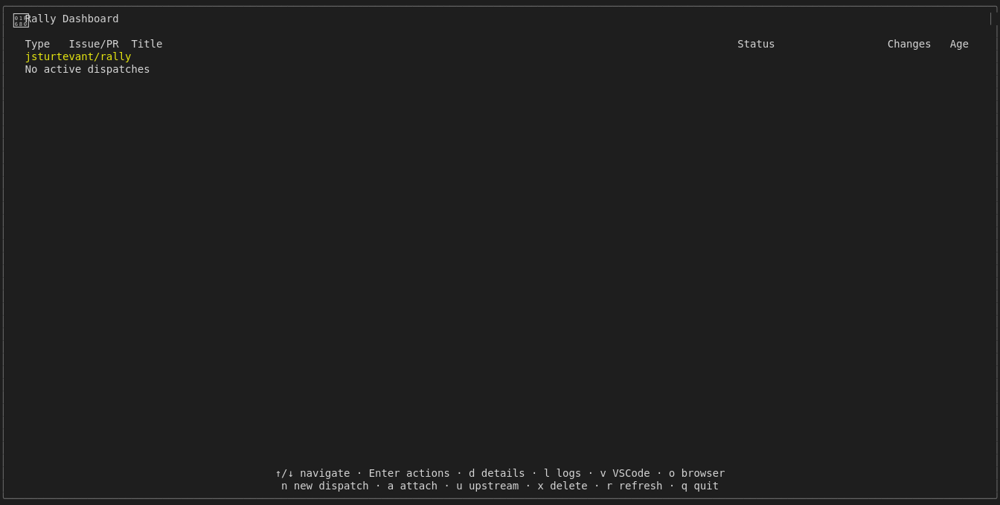

# Help Overlay

Tests the help overlay functionality:
- ? shows shortcut help overlay
- ? again or Escape hides it
- Screenshot the help overlay for visual regression

## Screenshots

The following screenshots show the visual state at each step:

### Before Help

### Help Overlay

### Help Shown

### Help Hidden

### Help Before Escape

### Help After Escape

### Baseline Help 160x40

### Baseline Help 80x24

### Baseline Help Overlay

---

*Generated from [`test/e2e/journeys/navigation/help.test.js`](../../test/e2e/journeys/navigation/help.test.js)*
