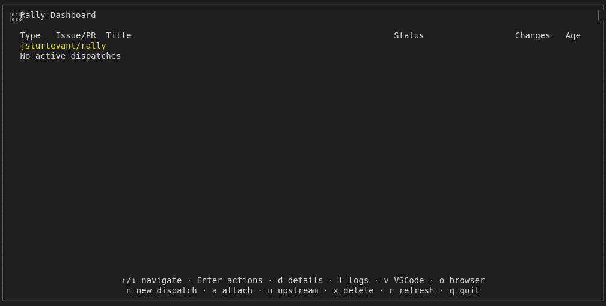
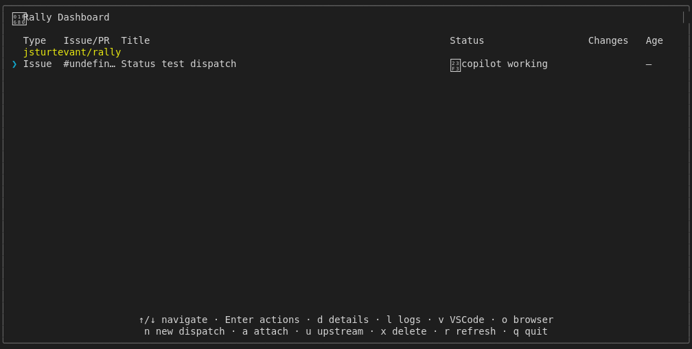
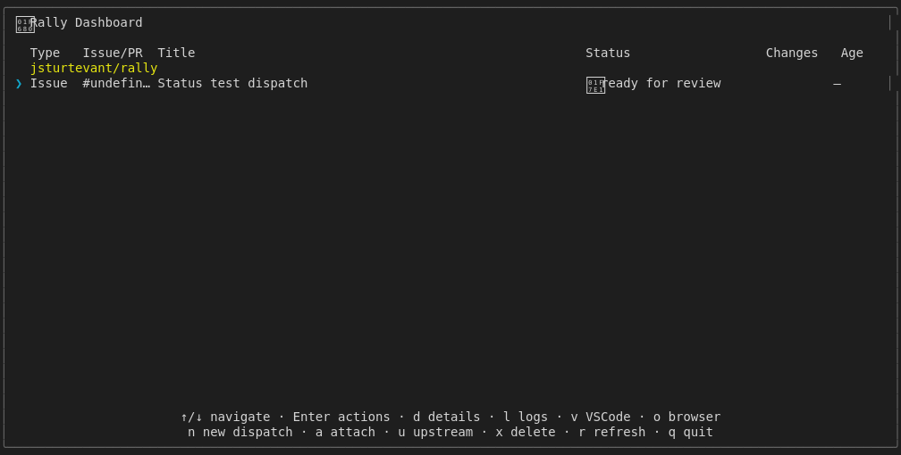
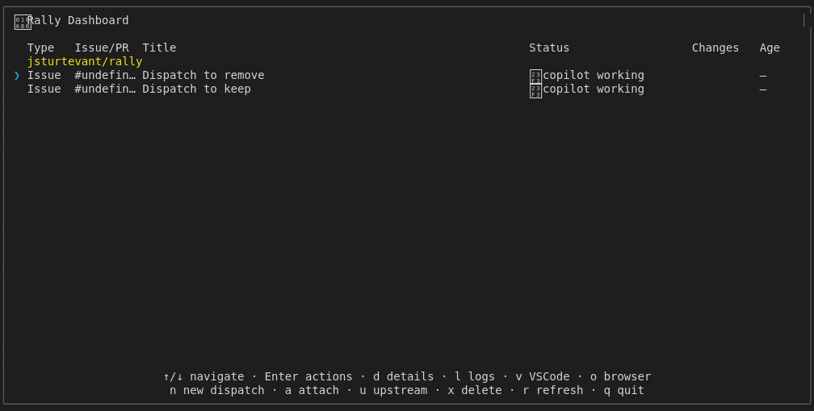
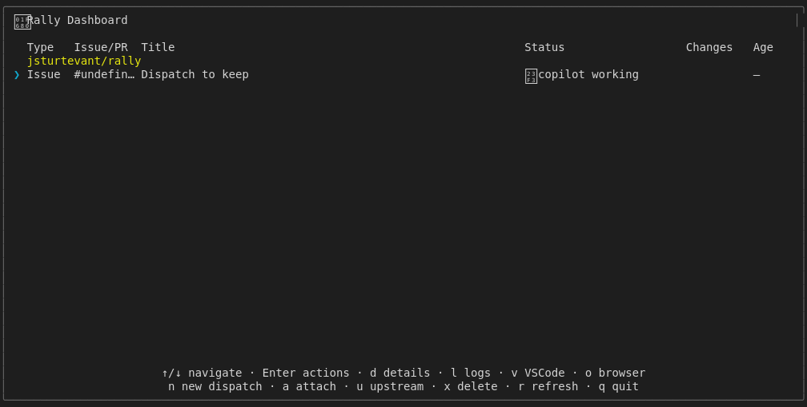
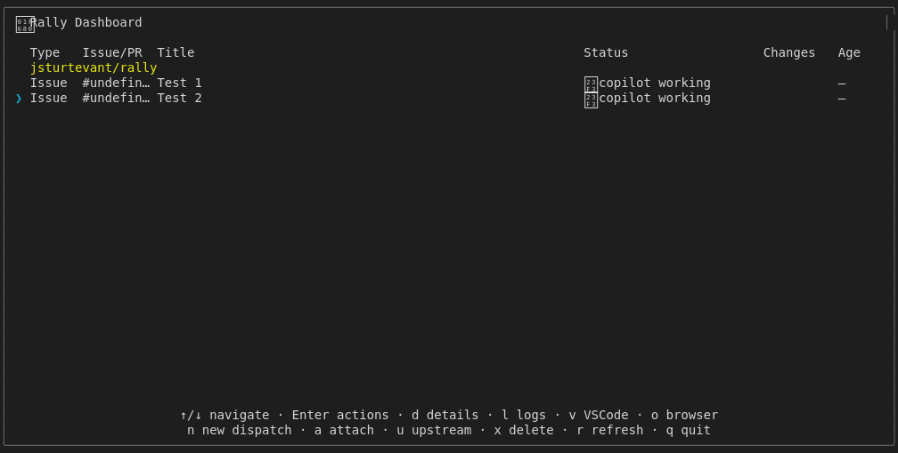
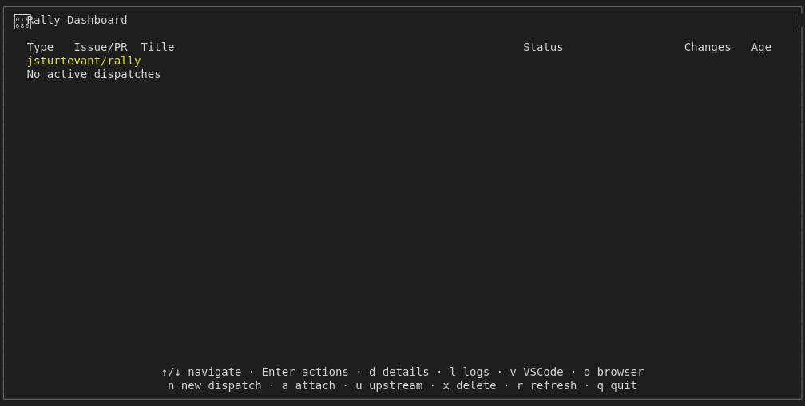
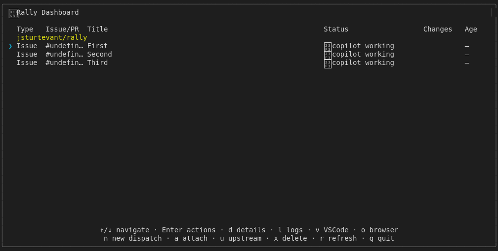

# Dashboard Refresh

Tests refresh behavior:
- r key refreshes the dashboard data
- Status updates appear after refresh

## Screenshots

The following screenshots show the visual state at each step:

### Before Refresh

### After Refresh

### Rapid Refresh

### Empty Before

### New Dispatch After

### Status Before

### Status After

### Removal Before

### Removal After

### Nav Refresh Interleave

### Corrupt Config

### Selection After Refresh

---

*Generated from [`test/e2e/journeys/navigation/refresh.test.js`](../../test/e2e/journeys/navigation/refresh.test.js)*
