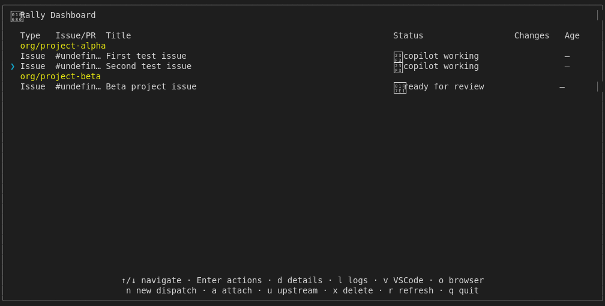
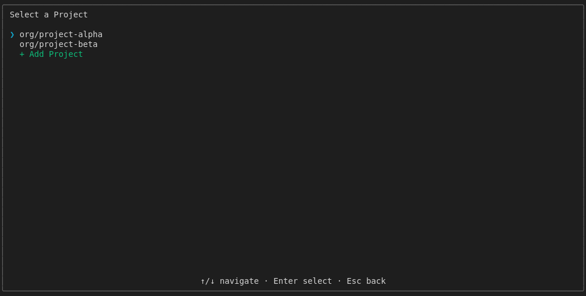

# Keyboard Navigation Selection

Tests keyboard navigation in the dashboard:
- j/k moves selection down/up
- ↑/↓ arrow keys work the same
- Selection wraps at list boundaries
- Multi-project navigation (moving between repo groups)

## Screenshots

The following screenshots show the visual state at each step:

### Initial

### After J

### After K

### Multiple J

### Arrow Down

### Arrow Up

### Mixed Navigation

### Wrap Bottom

### Wrap Top

### Multi Project

### Project Browser Nav

---

*Generated from [`test/e2e/journeys/navigation/selection.test.js`](../../test/e2e/journeys/navigation/selection.test.js)*
